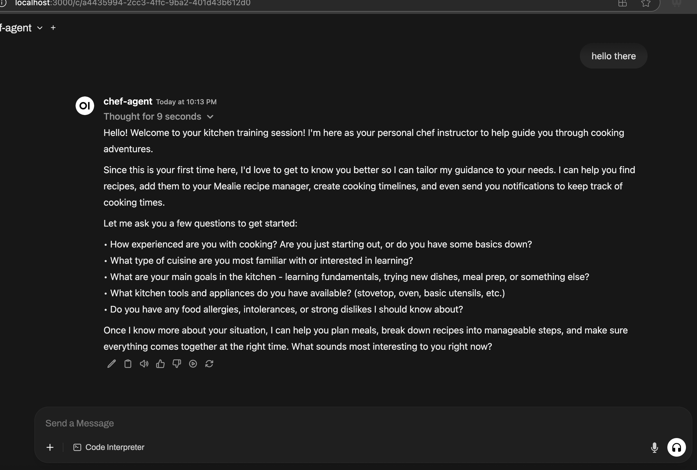
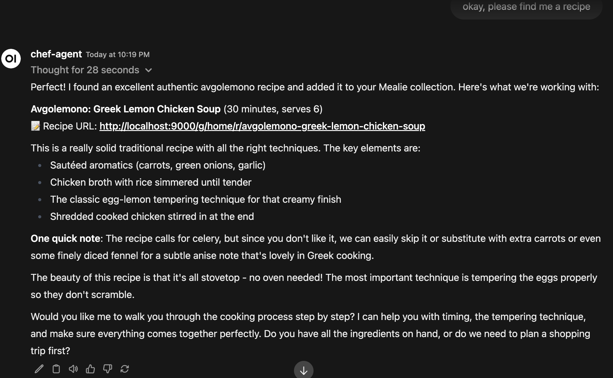

# RecipeLLM

This is an "out of the box" system that sets up an AI agent with a recipe manager and a notification system.


## Why Use It?

I started working on this a few months ago to learn how to cook.  It's like working with an experienced chef that can answer questions and fill in the gaps on cooking.

The first time you start it, you go to http://localhost:3000 and start filling the agent in on your skill level and what you want.  It will remember your details and can adjust recipes and instructions to match your personal tastes.



It can search the web and [import recipes into Mealie](https://tersesystems.com/blog/2025/03/01/integrating-letta-with-a-recipe-manager/), but it's also good at describing the recipe in context:



When you start cooking, you can tell it what you're doing and it will walk you through any adjustments you need to make and let you know how to fix any mistakes.  Here's an [example blog post](https://tersesystems.com/blog/2025/02/14/cooking-with-llms/).

I like to use this while I'm on the iPad, using Apple Dictation.  The below picture shows me using the self-hosted dev environment while making [ginger chicken](https://tersesystems.com/blog/2025/03/07/llm-complexity-and-pricing/).


## Requirements

You will need [Docker Compose](https://docs.docker.com/compose/install/) installed.

RecipeLLM requires an API key to a reasonably powerful LLM: either OpenAI, Anthropic, or Gemini.

If you want to use Google AI Gemini models, you will need a [Gemini API key](https://ai.google.dev/gemini-api/docs/api-key).

```
LETTA_CHAT_MODEL=google_ai/gemini-2.5-flash
```

If you want to use Claude Sonnet 4, you'll want an [Anthropic API Key](https://console.anthropic.com/settings/keys).

```
LETTA_CHAT_MODEL=anthropic/claude-sonnet-4-20250514
```

If you want to use OpenAI, you'll want an [OpenAI API Key](https://platform.openai.com/api-keys).

```
LETTA_CHAT_MODEL=openai/gpt-4.1
```

You can also download recipes from the web if you have [Tavily](https://www.tavily.com/) set up.  An API key is free and you can do 1000 searches a month.

## Running

Set up the system by running docker compose

```
docker compose up --build
```

The Docker Compose images may take a while to download and run, so give them a minute.  Once they're up, you'll have three web applications running:

* Open WebUI (how you chat with the agent): [http://localhost:3000](http://localhost:3000)
* ntfy (which handles real time notifications): [http://localhost:80](http://localhost:80)
* Mealie (the recipe manager): [http://localhost:9000](http://localhost:9000)

There's also the OpenAI proxy interface if you want to connect directly to the agent:

* OpenAI API: [http://localhost:1416/v1/models](http://localhost:1416/v1/models)

## Notifications

You can ask it to set reminders and notifications for you -- these will be sent to the local ntfy instance at http://localhost and you will hear a ping when the timer goes off.  You can also configure ntfy to send notifcations to your iPhone or Android device, which is what I do personally.

## Resetting

To delete the existing data and start from scratch, you can down and delete the volume and orphans:

```
rm -rf ~/.letta # if you want to delete the letta database

docker compose down -v --remove-orphans # if you want to delete mealie / ntfy
```
